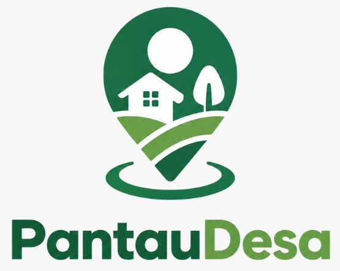

#  
PantauDesa 

Platform pemantauan pembangunan desa berbasis gamifikasi. Petugas membuat quest
pembangunan, warga memantau langsung di lapangan lewat foto + validasi GPS, dan
mengumpulkan XP untuk ditukar reward nyata (mis. minyak goreng, beras, pulsa).

Dibangun dengan **React 18 + Vite + Tailwind CSS**.

## Menjalankan proyek

```bash
npm install
npm run dev
```

Buka `http://localhost:5173` di browser. Untuk build produksi:

```bash
npm run build
npm run preview
```

## Akun demo

| Peran   | Username | Kata Sandi  |
|---------|----------|-------------|
| Admin   | admin    | admin123    |
| Petugas | rudi     | petugas123  |
| Warga   | budi     | warga123    |

Warga baru bisa mendaftar sendiri lewat halaman **Daftar** di layar login.
Akun Petugas hanya bisa dibuat oleh Admin (menu *Kelola Pengguna*).

## Struktur proyek

```
src/
├── App.jsx                 # Komponen utama: routing peran, state, aksi CRUD
├── main.jsx                # Entry point React
├── index.css                # Tailwind directives + base style
├── lib/
│   ├── data.js              # Seed data awal & fungsi bantu (haversine, level, format tanggal)
│   └── storage.js           # Lapisan persistensi berbasis localStorage
├── components/
│   ├── ui.jsx                # Komponen UI primitif (Button, Panel, Tag, dll.)
│   ├── AuthScreen.jsx         # Halaman Login & Daftar
│   └── Shell.jsx              # Layout sidebar (desktop) + hamburger (mobile), dipakai oleh Admin, Petugas & Warga
└── pages/
    ├── AdminPages.jsx         # Dashboard, Kritik & Saran, Kelola Pengguna, Kelola Reward
    ├── PetugasPages.jsx       # Dashboard, Buat/Daftar Quest, Verifikasi Laporan, Leaderboard
    └── WargaPages.jsx         # Beranda, Misi, Detail Misi, Reward, Peringkat, Profil — layout kartu/grid responsif
```

Ketiga peran (Admin, Petugas, Warga) memakai `Shell` yang sama sehingga tampilan
konsisten dan otomatis responsif: sidebar hijau tetap di desktop, berubah jadi
menu hamburger yang bisa dibuka-tutup di layar mobile.

## Alur inti

1. **Petugas** membuat quest baru (judul, kategori, XP, koordinat lokasi, radius toleransi meter, periode).
2. **Warga** membuka misi aktif, mengunggah foto bukti pantauan, lalu mengecek lokasi GPS.
   Jarak dihitung dengan rumus haversine terhadap koordinat proyek — laporan hanya bisa
   dikirim jika berada dalam radius yang ditentukan, dan dibatasi 1 laporan/quest/hari.
3. **Petugas** meninjau laporan masuk (foto + jarak GPS), menyetujui (memberi XP) atau menolak.
4. **Warga** menukar XP dengan reward yang tersedia; stok otomatis berkurang.
5. **Admin** memantau statistik keseluruhan, mengelola kritik & saran warga, kelola pengguna,
   dan kelola katalog reward.

